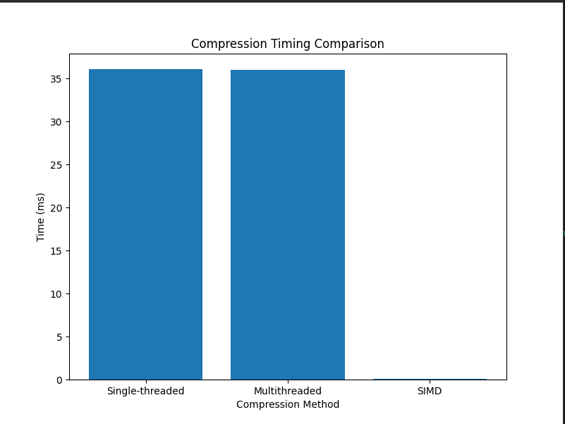
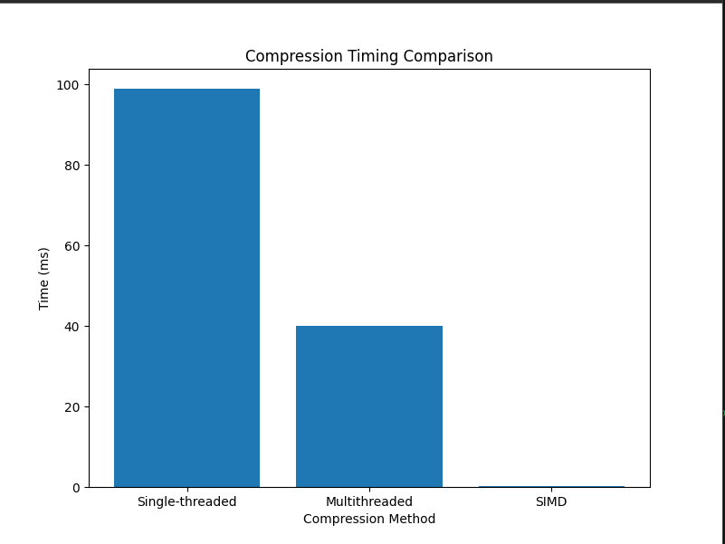
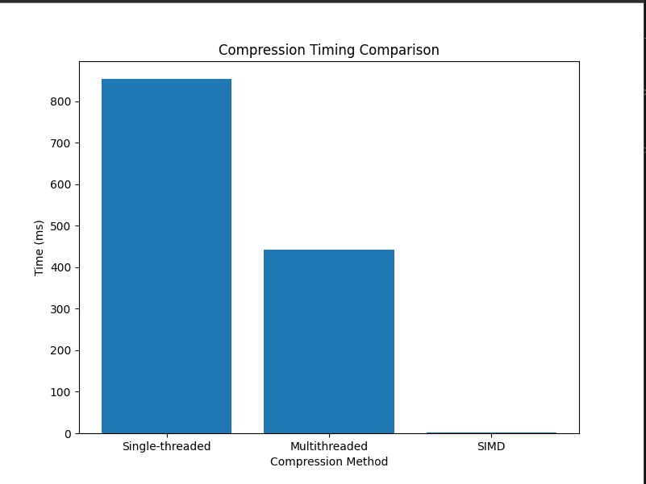
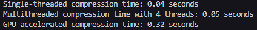
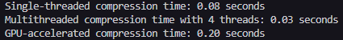
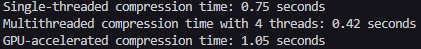

# Comparing OpenCV Image Compression to Primitive SIMD Optimized Image Compression, and GPU Compression (Using CuPy)

## Running the Program

To compile the program, run: 

`g++ -o <output> main.cpp 'pkg-config --cflags --libs opencv4' -pthread -mavx2 -ljpeg`

Then run the program: `./<output> <image_folder_name>`

Afterwards, to see the output graph of compression times, run `python3 plot.py`

To run the GPU compression program that compares GPU compression to single and multithreaded, use: `python3 main.py`

Dependencies:

OpenCV: https://opencv.org/get-started/

## Overview 
This project aims to compare the efficiency of different image compression methods, utilizing OpenCV compression as a baseline for comparison.

## OpenCV Compression Method 

OpenCV uses a Discrete Cosine Transform (DCT) to compress a provided image into a jpg image. 

In order to speed this process up, I decided to provide an option for multithreading through the function **multithreadedCompression**. 
This function is pretty simple, it creates a threadpool (based on a user specified amount of threads) to individually work on the images in the image input folder, using a mutex to protect queue access.

The singlethreaded implementation is even simpler, it simply runs the OpenCV image compression function for each image provided in an input folder.

These functions serve as a baseline for comparison to the custom SIMD compression and the CuPy GPU compression methods described below.

## SIMD Compression Method

The **downsampleWithSIMD** function performs a downsampling operation on an image using SIMD (Single Instruction, Multiple Data) instructions to efficiently compute the average pixel values for reducing the image size by half in both dimensions. Here's a breakdown of its behavior:

The function reduces the resolution of an image by averaging groups of 2x2 pixel blocks in the input image and producing a single pixel for each block in the output image.

Inputs:

**input**: A vector of raw pixel data (e.g., RGB or grayscale).  
**output**: A vector to store the downsampled pixel data. 
**width**: Width of the original image in pixels. 
**height**: Height of the original image in pixels. 
**channels**: Number of color channels (e.g., 3 for RGB, 1 for grayscale).

Functionality: 

First, the function calculates the dimensions of the new downsampled image by dividing the original images' width by 2 **(new_width = width/2)**, and dividing the original images' height by 2 **(new_height = height/2)**. 
It then iterates over all the output pixels, each of which correspond 
to a 2x2 block in the original input imag.

Then, for each output pixeel, the program will identify and input 2x2 block of the original image, load the 4 pixel block into a SIMD register, compute the sum of these pixels, 
divide the resulting sum by 4 to compute the average of the 4 pixels, and finally write the average value into its proper location in the output vector. At the end of the process, the output vector should have a downsampled image that is have the height and width of the original image, 
effectively containing half of the information of the original.

For exeample, if the input matrix is provided as:  

[ 10, 20, 30, 40 ]  
[ 50, 60, 70, 80 ]  
[ 90, 100, 110, 120 ]  
[ 130, 140, 150, 160 ]  

The program reading the 2x2 block at (0,0)  

[ 10, 20 ] 
[ 50, 60 ] 

After the processes of averaging, the output matrix would be calculated like this: 

(10+20+50+60)/4 = 35 
(30+40+70+80)/4 = 55  
(90+100+130+140)/4 = 105  
(110+120+150+160)/4 = 125  

Resulting Matrix  
[ 35, 55 ] 
[ 105, 125 ] 

## GPU Compression

For GPU compression the goal was simply to upload an image into the 

## Results
### SIMD Results
When compiling 1 image from the images folder, SIMD compression far exceeds the OpenCV benchmark, with the multithreaded and single threaded implementations being inditinguishable (as expected).

Results with 4 threads and a single image:
 

When compiling 6 images from the images folder, the SIMD compression method still far exceeds the benchmark. Here we begin to see the impact that multithreading has with accelerating runtime by compressing multiple images at once.

Results with 4 threads with 6 images:
 

When compiling 11 iamges from the images folder, it becomes clear that the simple SIMD compression method greatly outperforms both the singlethreaded and multithreaded approach found when utilizing the OpenCV libraries default compression. One thing to note is that the effects of multithreaded can be better noticed with the larger image count.

Results with 4 threads and 11 images:
 

### GPU Results: 

The results for the GPU are surprisingly slow, with detrimental compression time that is exaggerated with the number of images compressed.

Results for compressing 1 image with 4 core multithreading:

 

Results for compressing 6 images with 4 core multithreading:

  

Results for compressing 11 images with 4 core multithreading:

 

## Image Quality Comparison 
Although more qualitative that an objective runtime, we can clearly see a difference in image quality pre and post compression.

Original image: 
 

OpenCV compressed image (singlethreaded):
 

OpenCV compressed image (multithreaded): 
  

Custom compressed image (SIMD):  
 

Custom compressed image (GPU):  

In comparison to the original image, the SIMD and GPU compressed images appear to be of lesser quality, especially when compared to the DCT comressed images that result from the OpenCV compression fuction.
## Conclusion
Overall, we can conclude that a "lazy" algorithm that repeats the same process of downscaling the image by half by averaging the values in a matrix and reducing the matrix size, while it may be the fastest method, it does greatly reduce the quality of the image (qualitatively). 

Although I am not entirely certain, I believe that the reason why the GPU compression method takes so long is due to overhead. When compressing an image in the CPU, the CPU, which has direct memory access, needs to pull the image from memory and then compress the image within the CPU, whereas when compressing images in the GPU, it must load the image(s) from memory, into the CPU and then into the GPU, then back to the CPU to write the image into storage. This could be part of the reason as to why GPU image compression is so slow. 

A potential way to improve this is to utilize SIMD with a DCT algorithm within OpenCV, to get a truly rapid method of compression. 

Compressing images has benefits and tradeoffs, you can get image quality or speed, but one must be traded for the other.

