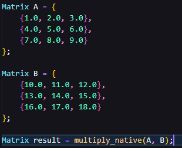
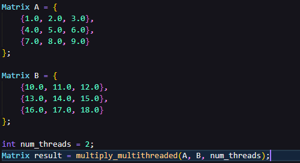
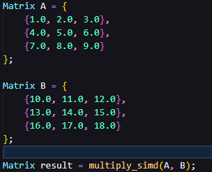
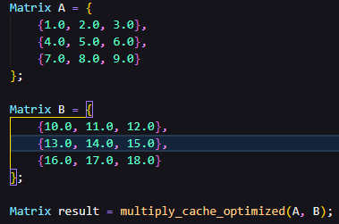
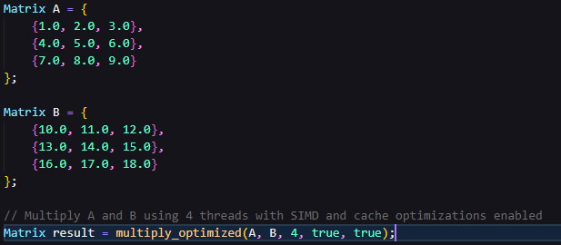
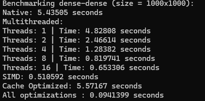
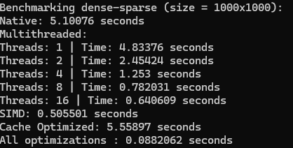
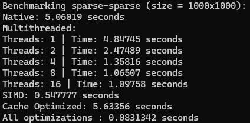
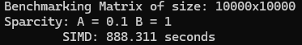
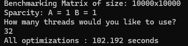

# Project 2 Readme
## How to use the program:
Compile **main.cpp** using the terminal command: **g++ main.cpp -mavx2 -mfma** 
you can use the optional **-o <output_file_name>** to specify the name of the file you want to run 
(default = **a.out**) 
Afterwards, run the output (**./a.out**) and then follow the prompts that appear on your terminal until program completion.

# How the Functions Work

## Multiply Native
### Overview
The **multiply_native** function implements a simple matrix multiplication algorithm using standard nested loops. The function takes two matrices, **A** and **B**, as inputs and returns the result of their multiplication. 

### Parameters
- **A**: The first input matrix (a 2D vector of floats).
- **B**: The second input matrix (a 2D vector of floats).

### Returns
- **result**: The matrix product of **A** and **B**, returned as a new matrix (also a 2D vector of floats).

### Algorithm
- The matrix multiplication is performed using the standard triple nested loop method:  
    1: Outer loop iterates over the rows of matrix **A**. 
    2: Middle loop iterates over the columns of matrix **B**. 
    3: Inner loop calculates the dot product of the **i**-th row of matrix **A** with the **j**-th column of matrix **B**. 
- The **result** matrix is initialized with zero values and gets updated as each element is computed.

### Usage 

## Multiply Multithreaded 
### Overview 
The **multiply_multithreaded** function implements matrix multiplication using multiple threads to divide the workload across available processing cores. It improves performance by parallelizing the computation of the matrix product.

### Parameters
- **A**: The first input matrix (a 2D vector of floats).
- **B**: The second input matrix (a 2D vector of floats).
- **num_threads**: The number of threads to use for parallelizing the matrix multiplication.

### Returns
- **result**: The matrix product of **A** and **B**, returned as a new matrix (also a 2D vector of floats).

### Algorithm
The matrix multiplication follows the traditional triple-nested loop structure:

1: Outer loop (parallelized): iterates over the rows of matrix **A**.  
2: Middle loop: iterates over the columns of matrix **B**. 
3: Inner loop: computes the dot product of the **i**-th row of **A** and the **j**-th column of **B**.

### Multi-threading Logic
- The matrix is split into chunks of rows, each processed by a separate thread.
- A lambda function worker handles the matrix multiplication for a specific range of rows, which is assigned to each thread.
- The total number of rows is divided evenly across the threads, and each thread computes the result for its assigned rows independently.
- After spawning the threads, the main thread waits for all threads to complete their work by calling **join()** on each thread.

### Usage 

## Multiply SIMD
### Overview
The **multiply_simd** function performs matrix multiplication using SIMD (Single Instruction, Multiple Data) instructions, specifically AVX (Advanced Vector Extensions) for floating-point operations. This approach enhances performance by leveraging parallel computation on vectors of data, speeding up the multiplication of large matrices.

### Parameters
- **A**: The first input matrix (a 2D vector of floats).
- **B**: The second input matrix (a 2D vector of floats).

### Returns
- **result**: The matrix product of A and B, returned as a new matrix (also a 2D vector of floats).

### Algorithm
The matrix multiplication is performed using the standard nested loop approach with AVX SIMD instructions applied to the innermost loop for vectorized processing.

1: Outer loop: Iterates over rows of matrix **A**. 
2: Middle loop: Iterates over columns of matrix **B**. 
3: Inner loop: Uses AVX instructions to load and multiply vectors of 8 floats from matrix **A** and matrix **B** in parallel. The results are accumulated using fused multiply-add instructions. 
4: Sum reduction: The resulting vector from the SIMD calculation is stored in a temporary array, and its elements are summed to compute the final value for **result[i][j]**.

### SIMD Details
- The inner loop loads 8 consecutive elements from matrix **A** and **B** into AVX registers (**__m256**).
- It performs the fused multiply-add operation on the loaded vectors.
- After processing the blocks, the partial results are stored back in a temporary array and summed to get the final scalar value for the matrix element.

### Usage 

## Multiply Cache Optimized 
### Overview
The **multiply_cache_optimized** function is designed to optimize matrix multiplication by improving cache locality. This approach utilizes blocking (also known as tiling) to divide matrices into smaller blocks that fit into the CPU cache, thereby reducing cache misses and improving performance, especially for large matrices.

### Parameters
- **A**: The first input matrix (a 2D vector of floats).
- **B**: The second input matrix (a 2D vector of floats).

### Returns
- **result**: The matrix product of **A** and **B**, returned as a new matrix (also a 2D vector of floats).

### Cache Performance Issues in Matrix Multiplication
In a standard matrix multiplication algorithm, elements from matrices **A** and **B** are accessed repeatedly in a non-sequential order, causing cache misses. 
By dividing the matrices into blocks, we ensure that smaller portions of the matrices fit into the cache, reducing memory access time and improving performance.

### Blocking (Tiling) Approach:
The function divides the input matrices **A** and **B** into blocks of size **block_size** x **block_size**. 

Each block is processed independently, ensuring that as much data as possible remains in the CPU's cache while performing matrix multiplication.

### Algorithm
The matrix multiplication is performed using a blocked approach to enhance cache efficiency:

1: Outer loops: Iterate over matrix **A** by blocks of **rows**, matrix **B** by blocks of **columns**, and the shared dimension by blocks. 
2: Inner loops: Perform standard matrix multiplication for the elements within each block. 
3: Each block of the matrix is processed so that data from matrices **A** and **B** fits into the CPU cache, minimizing cache misses during the computation.

### Blocked Matrix Multiplication
- The matrices are divided into blocks of size **block_size** x **block_size**.
- Block Size: Chosen to fit into the CPU's cache. For example, a block size of 64 ensures that chunks of 64x64 elements are processed at a time.
- For each block, matrix multiplication is performed on the smaller submatrices.

### Usage

## Multiply Optimized
### Overview
The **multiply_optimized** function is a highly versatile matrix multiplication implementation that combines multi-threading, SIMD (Single Instruction, Multiple Data) optimizations, and cache-aware techniques. This function allows for toggling between different optimizations to achieve the best performance based on hardware capabilities and matrix sizes.

### Parameters
- **A**: The first input matrix (a 2D vector of floats).
- **B**: The second input matrix (a 2D vector of floats).
- **num_threads**: The number of threads to use for parallelizing the computation.
- **use_simd**: A boolean flag to enable SIMD-based optimizations if available.
- **use_cache_optimization**: A boolean flag to enable cache-blocking optimizations.

### Returns
- **result**: The matrix product of **A** and **B**, returned as a new matrix (also a 2D vector of floats).

### Helper Function
The helper function, **block_multiply**, performs standard block multiplication for a submatrix of **A** and **B**, accumulating results in the corresponding block of the **result** matrix. 

It is called when SIMD is not used but blocks are still processed due to the cache optimization or standard blocking approach.

**block_multiply** has parameters:
- **A**: The first input matrix (a 2D vector of floats).
- **B**: The second input matrix (a 2D vector of floats).
- **result**: The matrix to store the multiplication result.
- **i_start**, **i_end**: The row range in matrix **A** to process.
- **j_start**, **j_endv**: The column range in matrix **B** to process.
- **k_start**, **k_end**: The range in matrix **A** and **B**'s shared dimension to process.

### Algorithm
1: Threading Setup

- The input matrix **A** is divided into blocks of rows, and each thread processes its assigned block independently.
- The number of rows per thread is computed as **rows_A** / **num_threads**, and each thread handles a subrange of rows based on its index.

2: Blocking

- The matrices are split into smaller blocks based on the **block_size**. If cache optimization is enabled, a **block_size** of 64 is used. Otherwise, the entire row or column range is processed at once.
- For each block of rows and columns, either standard or SIMD-based multiplication is applied.

3: SIMD Processing

- If SIMD is enabled, 8 elements are processed in parallel using AVX instructions. The partial sums are stored in temporary arrays, and the final result for each block is accumulated into the **result** matrix.

4: Standard Block Multiplication

- If SIMD is disabled, the **block_multiply** function is called to process each block of the matrices, multiplying and accumulating the results into the **result** matrix.

5: Thread Synchronization

- Once each thread finishes its assigned work, it is joined with the main thread to ensure the final result is correctly computed across all threads.

### Usage 

## Benchmarking 
All benchmark files are structured to run their specified optimization, logging the time it takes for the optimization function to run given:

### Parameters
- **A**: The first input matrix (a 2D vector of floats).
- **B**: The second input matrix (a 2D vector of floats).
- **num_threads**: The number of threads to use for parallelizing the computation.
- **use_simd**: A boolean flag to enable SIMD-based optimizations if available.
- **use_cache_optimization**: A boolean flag to enable cache-blocking optimizations.

## Main
**main** is pretty straightforward. 

It takes user input for matrix size and density and then prompts the user to specify which form of optimizations they want, then benchmarks accordingly.

## Outcomes 
For the result below, interpret dense to mean 0.1% sparcity and sparse to indicate 1.0% sparcity unless otherwise indicated in the terminal snippet.
### Dense-dense matrix (size = 1000x1000)
Results

### Dense-sparse matrix (size = 1000x1000)
Results

### Sparse-sparse matrix (size = 1000x1000) 
Results

### Big matrix (size = 10000x10000)
Results (the multiplication of these matrices took quite some time, so I only ran the functions that would run witin a reasonable timeframe)
- SIMD  

- All optimizations (using 32 threads)  

## Conclusion
After experimenting with differnt matrix optimizations, we realize that the more sparse a matrix is, the faster it can be multiplied. Additionally, although cache miss optimization on its own is a slow process, when combined with SIMD and multithreaded optimizations, it becomes the fastest process of multiplying matrices.

Native matrix multiplication should be avoided as much as possible, as it has the slowest possible runtime. Parralizing through multithreading is a way to speed up native multiplication, but it is still relatively slow in comparison to SIMD when used as a standalone process. Where matrix optimization truly thrives is when combining optimization methods.