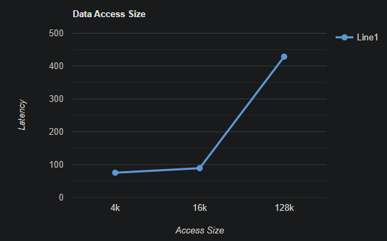
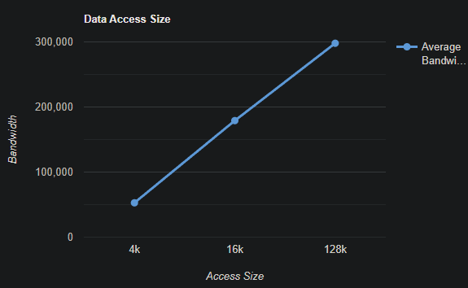
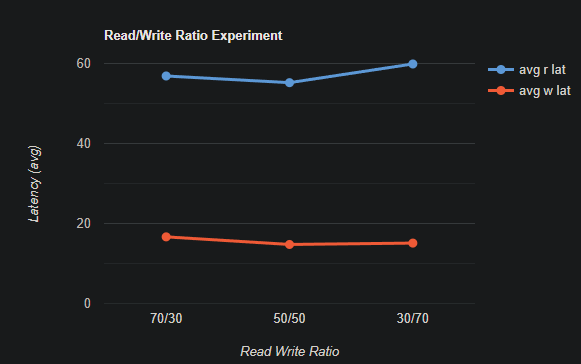
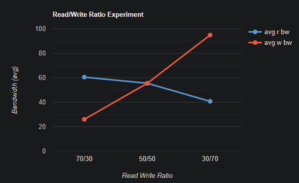
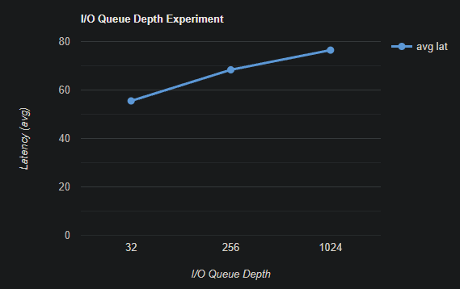
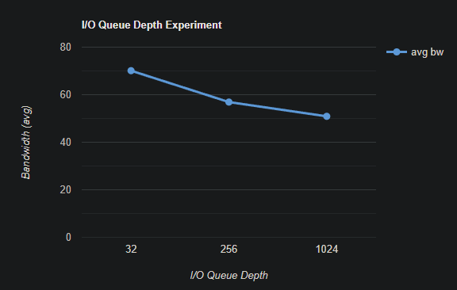

# Project 3
## Usage
To run the program, use the following prompt:  **sudo fio [options] [fio_file] --output=<output_name> --output-format=<json,terse,txt...>**
## Data Access Size Experiment
All other variables besides data access size were held constant to ensure that only the impact from varying access size was being measured. Read was set to 100% for all of the experiments so that way there is minimal variablity on the read operation influence. The queue size was set to a low number (32) so there would be a minimal queue latency in comparison to the large variations in access size to ensure that the latency and bandwidth measurements for access size would be predominant.
### Test 1
Variable Values

- access size = 4KB
- read = 100%
- write = 0%
- I/O queue depth = 32

### Results

- latency ($\mu s$):
    - min=10
    - max=6920
    - avg=75.52
    - stdev=21.11

- bandwidth ($KB/s$): 
    - min=44056
    - max=54624
    - per=100.00%
    - avg=52769.76
    - stdev=1935.92

### Test 2
Variable Values

- access size = 16KB
- read = 100%
- write = 0%
- I/O queue depth = 32

### Results

- latency ($\mu s$)
    - min=14
    - max=4355
    - avg=89.23
    - stdev=32.47

- bandwidth ($KB/s$)
    - min=146880
    - max=182976
    - per=100.00%
    - avg=179054.10
    - stdev=5338.26

### Test 3
Variable Values

- access size = 128KB
- read = 100%
- write = 0%
- I/O queue depth = 32

### Results

- latency ($\mu s$)
    - min=53
    - max=7429
    - avg=428.73
    - stdev=72.13

- bandwidth ($KB/s$)
    - min=281344
    - max=326656
    - per=100.00%
    - avg=297908.56
    - stdev=9134.70

### Plot
Access Size(KB) vs Average Latency($\mu s$):
 

Access Size(KB) vs Average Bandwidth($KB/s$):
 

### Analysis

Whilst changing data size, and keeping queue depth and read/write ratio constant, it can be observed that latency increases in direct proportion to the size of the data being read/written (in this case read). However, the bandwidth increases linearly, though its utilization remains 100%. This is to be expected, because it falls to reason that the more data that is chosen to read or write from, the longer the operation should take. The reason for the large spike in latency from 16kb to 128 kb is partially due to the drastic increase in the space read, but also because since the queue is small, it cannot be optimized to read faster. This is a perfect reflection of queuing theory, that is, higher throughput (bandwidth) is achieved at the cost of a higher latency.

## Read/Write Ratio Experiment
All other variables besides read/write ratio were held constant to ensure that only the impact from varying the ratio was being measured. Data access size was set to a low value (4k) to ensure that it was contributing a low and constant bandwidth. I/O queue depth was set to a low value of 32 so access to the q was fast (low latency), efficient (low bandwidth), and predictable (constant bandwidth). With these variables set to constant, the output data can be reasonably assumed to be influenced solely by the varying read/write ratios.

### Test 1
Variable Values

- access size = 4KB
- read = 70%
- write = 30%
- I/O queue depth = 32

### Results
- read latency ($\mu s$)
    - min=10,
    - max=4213
    - avg=56.88
    - stdev=42.13
- write latency ($\mu s$)
    - min=11
    - max=3830
    - avg=16.66
    - stdev=20.10

- read bandwidth 
    - 15.5k IOPS
    - 60.5 MiB/s

- write bandwidth 
    - 6645 IOPS
    - 26.0 MiB/s

### Test 2
Variable Values

- access size = 4KB
- read = 50%
- write = 50%
- I/O queue depth = 32

### Results

- read latency ($\mu s$)
    - min=27
    - max=3350
    - avg=55.21
    - stdev=58.56
- write latency ($\mu s$)
    - min=11
    - max=4179
    - avg=14.76
    - stdev=15.78

- read bandwidth 
    - 14.2k IOPS
    - 55.5 MiB/s

- write bandwidth 
    - 14.2k IOPS
    - 55.4 MiB/s

### Test 3
Variable Values

- access size = 4KB
- read = 30%
- write = 70%
- I/O queue depth = 32

### Results

- read latency ($\mu s$)
    - min=28
    - max=3513
    - avg=59.88
    - stdev=80.86
- write latency ($\mu s$)
    - min=11
    - max=4392
    - avg=15.10
    - stdev=14.53

- read bandwidth 
    - 10.4k IOPS
    - 40.7 MiB/s

- write bandwidth 
    - 24.3k IOPS
    - 94.9 MiB/s

### Plot
Read/Write Ratio vs Average Latency($\mu s$):
 
Read/Write Ratio vs Average Bandwidth($MB/s$):
 
### Analysis

For read/write ratio being a variable and holding queue depth and data size constant, we can observe a nearly negligible difference in latency across both read and write latencies relative to themselves. This is because since the data size is kept constant, the read and write operations should not take a significantly longer or shorter time to complete their task of reading and writing to the same amount of space. However, the bandwidth the read and write operations need to utilize to fulfill their job are drastically different. Writes take a substantial more amount of bandwidth to complete, but have a low latency for completion. However, reads take substantially less bandwidth than writes, but have a higher latency. Read latency could be optimized with a smaller queue, as there would be less time searching for the requested data, but that would come at the expense of bandwidth, needing to use higher bandwidth to accomplish its task. The reason why writes take up more bandwidth than a read operation would most likely be because they need to search the data pool for free space.

## I/O Queue Depth Experiment
All other variables besides I/O queue depth were held constant to ensure that only the impact from varying the depth was being measured. Read/Write ratio was set to 100/0 because after the last experiment, it was realized that read bandwidth is much faster than write bandwidth, so to reduce overall bandwidth for this experiment, read was set to 100% as a constant read latency and bandwidth throughout. Data access size was set to a low 4k to have a constant 4k write so that the bandwidth occupied by the data access size would remain low. These settings allow for the I/O queue size changes to not get bogged down by a high bandwidth usage and latency from any other operation than the changing queue size.

### Test 1
Variable Values

- access size = 4KB
- read = 100%
- write = 0%
- I/O queue depth = 32

### Results

- latency ($\mu s$):
    - min=10
    - max=6873
    - avg=55.53
    - stdev=22.65

- bandwidth: 
    - 17.9k IOPS
    - 70.1 MiB/s

### Test 2
Variable Values

- access size = 4KB
- read = 100%
- write = 0%
- I/O queue depth = 256

### Results

- latency ($\mu s$):
    - min=10
    - max=7025
    - avg=68.35
    - stdev=19.45

- bandwidth: 
    - 14.6k IOPS
    - 56.9 MiB/s

### Test 3
Variable Values

- access size = 4KB
- read = 100%
- write = 0%
- I/O queue depth = 1024

### Results

- latency ($\mu s$):
    - min=10
    - max=6916
    - avg=76.47
    - stdev=37.24

- bandwidth: 
    - 13.0k IOPS
    - 50.9 MiB/s

### Plot
IO Depth vs Average Latency($\mu s$):
 
IO Depth vs Average Bandwidth($MB/s$):
 
### Analysis

With read being held at a constant 100% and data size being kept at 4kb, the change in queue depth has and influence on both latency and bandwidth. As the queue depth increases, latency too increases. This is to be expected, as the larger the queue is, the longer each request spends in the queue. However, what is particularly interesting is that while latency is increasing in this case, throughput decreases. There could be several reasons for this. One is that the ssd is bottlenecked by the queue depth being so large, and for each read operation, it is taking too long searching for either queue or data space and it takes so long to find avaliable space that it cannot process requests at a fast enough rate, thus decreasing the bandwidth. This is called a controller overload, when the amount of parralel operations an ssd can feasibly do has reached an upper limit and the added queue depth is unoptimal for the ssd.

### Comparison to the Intel Benchmark provided
The amount of IOPS is was able to produce with a 4KB data size and 1024 queue depth was 67.2k IOPS. This is expected as my ssd is rather old (2016) and is worse than the intel ssd I am benchmarking against, and cannot handle as many parralel operations as the more advanced intel SSD.
