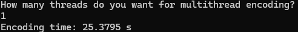
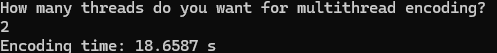
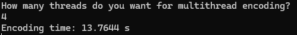
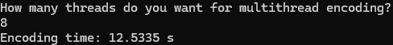
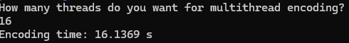
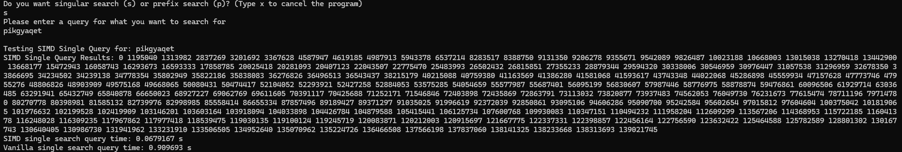
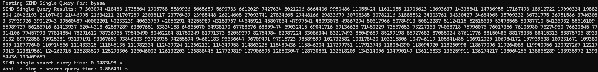
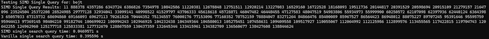
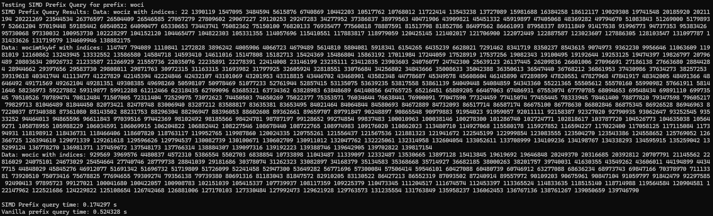

# Project 4: Multithreaded Dictionary Encoding and SIMD Search

## Table of Contents
- [Dictionary Codec Project](#project-4)
- [Table of Contents](#table-of-contents)
- [Overview](#overview)
- [Features](#features)
- [Requirements](#requirements)
- [File Structure](#file-structure)
- [Usage](#usage)
- [Code Structure](#code-structure)
  - [1. Dictionary Encoding Structure](#1-dictionary-encoding-structure)
  - [2. Querying](#2-querying)
  - [3. File Handling](#3-file-handling)
  - [4. Performance Measurement](#4-performance-measurement)
- [Testing](#testing)
  - [1. Dictionary Encoding](#1-dictionary-encoding)
  - [2. Search Operations](#2-search-operations)
  - [3. Prefix Matching](#3-prefix-matching)
- [Conclusion and Insights](#conclusion-and-insights)
- [Key Findings](#key-findings)
  - [1. Multithreading](#1-multithreading)
  - [2. SIMD Acceleration](#2-simd-acceleration)
  - [3. Vanilla Methods](#3-vanilla-methods)
- [Future Optimizations](#future-optimizations)
  - [1. Dynamic Load Balancing](#1-dynamic-load-balancing)
  - [2. Advanced SIMD Techniques](#2-advanced-simd-techniques)
  - [3. Memory Optimization](#3-memory-optimization)
- [Final Thoughts](#final-thoughts)

## Overview
This program implements a high-performance system for processing textual data. It includes:
- **Multithreaded Dictionary Encoding**: Encodes data efficiently using multiple threads to leverage modern multi-core CPUs.
- **SIMD-Accelerated Search**: Uses Single Instruction Multiple Data (SIMD) instructions for fast prefix and exact query searches.
- **Vanilla Search**: Provides a baseline comparison for search operations without SIMD optimization.


## Features
1. **Dictionary Encoding**:
   - Compresses input data by replacing strings with integer IDs.
   - Uses multithreading to parallelize the encoding process for large datasets.
   
2. **Search Operations**:
   - **Exact Query Search**:
     - SIMD-based search for matching an exact string in encoded data.
     - Vanilla search for baseline performance comparison.
   - **Prefix Query Search**:
     - SIMD-optimized prefix search for high performance.
     - Vanilla prefix search for baseline performance comparison.

3. **File Handling**:
   - Reads input data from a file.
   - Outputs encoded data and dictionary mappings to a file.


## Requirements
- **Compiler**: C++17 or higher with support for SIMD intrinsics (e.g., GCC, Clang, MSVC).
- **Libraries**: Standard C++ libraries; no external dependencies.


## File Structure
- **Input File**: `Column.txt`
  - Contains one data entry per line.
- **Output File**: `encoded_data.txt`
  - Contains the encoded data and dictionary mappings.

## Usage
1. Compile the code:
   ```bash
   g++ -o dictionary_encoder main.cpp -std=c++17 -march=native -O3

2. The output will be **a.out** <br>
    To run the program, type and run:
   ```bash
    ./a.out

## Code Structure

### 1. **Dictionary Encoding Structure**
Dictionary encoding compresses data by mapping each unique string to a unique integer ID. This reduces memory usage and accelerates subsequent queries.

#### Key Components:
- **`encodeChunk`**:  
  Encodes a subset of data, creating a local dictionary specific to the chunk.
  
- **`mergeDictionaries`**:  
  Combines thread-local dictionaries into a global dictionary, ensuring consistent mappings across chunks.

- **`encodeDictionary`**:  
  Executes dictionary encoding in parallel using multiple threads. Each thread processes a chunk of the input data, then merges its results into a global dictionary.

### 2. **Querying**
Efficient querying methods are implemented using both SIMD and vanilla approaches:
- **`simdQuery`**:  
  Accelerated exact match search using SIMD instructions.
  
- **`simdPrefixQuery`**:  
  Optimized prefix matching, comparing multiple strings simultaneously.

- **`vanillaSearch`** and **`vanillaPrefixQuery`**:  
  Baseline implementations for exact and prefix searches without SIMD.

### 3. **File Handling**
Functions for reading and writing data:
- **`readColumnFromFile`**:  
  Loads raw data from a text file into memory.
  
- **`writeEncodedColumnToFile`**:  
  Saves the encoded column and dictionary to a file for analysis or reuse.

### 4. **Performance Measurement**
- The **`Timer`** class measures elapsed time during encoding and query operations, providing insights into the efficiency of various approaches.

## Testing

### 1. Dictionary Encoding
Below is a demonstration of the effect of multithread dictionary encoding:
With using 1 thread: 
<br>
With using 2 threads:<br>
 <br>
With using 4 threads: <br>
<br>
With using 8 threads: <br>
<br>
With using 16 threads: <br>
<br>
Here is a graph of the results:<br>


In regards to dictionary encoding, it seems as though the general trend is that additional threads will decrease the encoding runtime, with diminishing returns.
### 2. Search Operations
Here are a few runs of the single search operation:<br>
Search for **pikgyaqet**
 <br>
Search for **byasa**

Search for **bojt**
 <br>

Overall, we can see that the SIMD accelerated search is far and away much more effective at finding singular items.
### 3. Prefix Matching
Now running a benchmark on prefix matching, we choose an easy prefix **woci** just for a concise output.
 <br>
Here we can see the same trend of SIMD being a faster operation than the vanilla test.
It outputs the indices in which all matching words with the prefix **woci** occur.

## Conclusion and Insights

### Key Findings
#### 1. **Multithreading**:  
   - Effectively accelerates dictionary encoding, especially for large datasets.  
   - Optimal performance depends on balancing the number of threads with available CPU resources.

#### 2. **SIMD Acceleration**:  
   - Delivers substantial speed-ups for both exact and prefix queries, reducing the time required to process large datasets.  
   - Outperforms vanilla methods due to its ability to process multiple comparisons in a single instruction cycle.

#### 3. **Vanilla Methods**:  
   - Provide a reliable baseline but are significantly slower for large datasets.


## Future Optimizations

#### 1. **Dynamic Load Balancing**:  
   Adjust thread workloads based on data distribution to minimize processing imbalances.

#### 2. **Advanced SIMD Techniques**:  
   Explore AVX-512 for even higher performance on supported hardware.

#### 3. **Memory Optimization**:  
   Reduce memory overhead by compacting the dictionary structure.


## Final Thoughts

This project demonstrates the power of multithreading and SIMD in handling large datasets, showcasing how modern CPU features can be leveraged for significant performance gains. It provides a scalable solution for dictionary encoding and querying, with potential applications in data compression, search engines, and real-time analytics.

