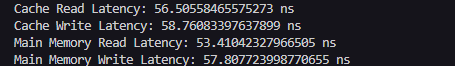
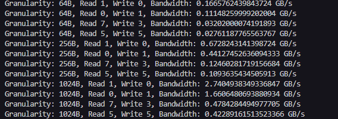
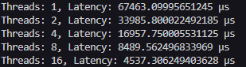
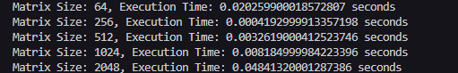
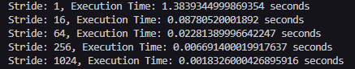

# README
### Analysis:  

## Test1.py  
This was designed to measure the read and write latency when there is zero queue delay.

Key Components:  

### 1: **NumPy Array Allocation**: 
The function **measure_latency** creates an array filled with 1.0 (64-bit floats, np.float64) using NumPy. The array size is passed as a parameter, allowing the function to simulate different memory regions:

- Cache-sized arrays: Simulate accesses that stay within the CPU cache.
- Main memory-sized arrays: Simulate memory accesses that spill over into main memory, resulting in higher latency. 

### 2: **Latency Measurement**: 
The function uses **time.perf_counter()** to measure the time taken for array accesses. This timer provides high-resolution timing, suitable for measuring small intervals like memory access latencies.

- Read Access: The loop reads each element of the array sequentially. The variable **_** discards the value, but forces the access to happen.
- Write Access: The loop sequentially writes the index i into each element of the array, modifying the data. 

### 3: **Array Size and Cache Simulation**:

- Cache: The size of the array (**cache_size**) is calculated to be 1 MB divided by 8 (to account for the size of each float64 element). This array size fits comfortably within modern CPU L2 or L3 cache.
- Main Memory: A larger array, 100 MB, simulates accesses that cause cache misses, thus accessing slower main memory. 

### 4: **Latency Calculation**: 
 The total time taken for the entire access operation is divided by the array size (**len(arr)**) to compute the average latency per access (either read or write).

### Output:  
 

## Test2.py  
 This was designed to measure memory bandwidth for read and write operations with varying granularities and read-write ratios. The code simulates accessing an array of float64 values in different configurations to calculate the bandwidth based on the amount of data transferred per unit of time.
 

### Key Components:  

### 1:  **Function Definition**:

- **measure_bandwidth(array_size, access_granularity, read_write_ratio=(1, 0))**: This function measures the bandwidth of memory accesses given a specific array size, access granularity, and a read/write ratio.

- ### **Params**:

    - **array_size**: The total number of elements in the array.
    - **access_granularity**: Number of elements to be read or written per access. This represents the chunk size for memory operations.
    - **read_write_ratio**: A tuple that defines the ratio between reads and writes. For example, (1, 0) represents read-only operations, (0, 1) is write-only, and (7, 3) would mean 7 reads for every 3 writes.

### 2: Array Initialization:

- **arr = np.ones(array_size, dtype=np.float64)**: The array is initialized with ones, consisting of float64 elements (8 bytes each)

### 3: Memory Access Simulation:

- The loop **for i in range(0, len(arr), access_granularity)** iterates over the array in steps of **access_granularity**.

- **Inside the loop**:

    - **Read Operations**: Based on total_reads, it reads chunks of the array (arr[i:i + access_granularity]).
    - **Write Operations**: Based on total_writes, it assigns values (arr[i:i + access_granularity] = i) to the array. The value written is the current index i for simplicity.

### 4: Time Measurement:

- **start_time = time.perf_counter()** and **end_time = time.perf_counter()** record the time before and after the memory access loop.

- **total_time = end_time - start_time** calculates the time taken for the memory accesses.

### 5: Bandwidth Calculation:

- **Data Transferred**: The amount of data transferred during the operation is calculated as **array_size * 8** (since each float64 is 8 bytes).

- **Bandwidth Formula**: The bandwidth is then calculated as:

$$ Bandwidth = \dfrac{\text{data  transferred}}{\text{total time x} 1024^3}$$
 
​
 
This gives the bandwidth in GB/s.

### Output:  
 

## Test3.py  
This was designed to simulate memory access patterns (both reads and writes) and measure the latency of these operations when performed concurrently using multiple threads.

### Key Components:  

### 1: Concurrency Handling with ThreadPoolExecutor
- The **ThreadPoolExecutor** from concurrent.futures is used to parallelize the memory access operations. It manages a pool of threads and allows tasks to be submitted for concurrent execution.
- The **max_workers** argument controls the number of threads used, which can be adjusted for different concurrency levels (1, 2, 4, 8, or 16 threads in the example).

### 2: Memory Access Simulation
- The function **memory_access_simulation(arr, start, end, access_type)** simulates memory access within the array **arr**.
    - **Read Access**: The loop accesses each element in the specified range **[start, end)** and reads its value.
    - **Write Access**: The loop writes a value (the index **i**) to each element in the range.
- This simulation mimics scenarios of memory-bound operations such as reading or writing to large arrays.

### 3: Latency Measurement
- The function **measure_latency_throughput(array_size, num_threads, access_type)** performs the following:
    - Creates an array of size **array_size** initialized with ones (**np.ones()**).
    - Divides the array into chunks based on the number of threads (**chunk_size**), ensuring each thread processes a portion of the array.
    - Submits the **memory_access_simulation** function as a task for each thread, using the thread pool.
    - Measures the execution time for all threads to complete their assigned tasks.
    - Computes the latency as the time taken per thread (by dividing the total execution time by the number of threads).

### 4: Threading and Scalability
- The code demonstrates how the performance of memory access varies with increasing thread count.
- By increasing the number of threads (threads = [1, 2, 4, 8, 16]), the code tests how the system handles concurrent memory accesses. More threads mean more simultaneous operations, but also more potential contention for shared resources like memory bandwidth.

### 5: Performance Output
- For each number of threads, the latency is printed in microseconds, indicating the average time per thread to complete the memory access.

## Output for Test 3:  
 

## Test4.py  
This was designed to perform matrix multiplication using NumPy and measures the execution time for different matrix sizes. The goal is to observe how matrix size impacts the execution time, potentially inducing cache misses due to the increasing data size.
### Key Components:  
1: Random matrix generation using NumPy  
2: Matrix multiplication with **np.dot()** 
3: Execution time measurement with Python's **time.perf_counter()** 
4: Experimentation with varying matrix sizes to study the effect of cache usage

### How It Works:
- The **matrix_multiply** function generates two square matrices of random values using **np.random.rand(size, size)**.
- It calculates the time taken to multiply the matrices using **np.dot()**.
- The script runs the multiplication for a series of matrix sizes (64, 256, 512, 1024, 2048) and prints the execution time for each size.

## Output for Test 4:  
 

## Test5.py  

This was designed to simulate the performance impact of Translation Lookaside Buffer (TLB) misses by accessing elements of a large array with varying strides. Below is a breakdown of the code and its functionality:

Key Components
### 1: Imports:

- **numpy**: Used to create and manipulate arrays. In this case, an array of floating-point numbers is created for the simulation.
time: Provides functions to measure the execution time of a code segment. 

### 2: Function: **tlb_miss_simulation**:

- Parameters:
    - **array_size**: The size of the array to be processed.
    - **stride**: The step size used to access elements in the array.
- Functionality:
    - Creates an array of size **array_size**, initialized with ones (np.ones) of type float64. The use of float64 ensures that each element occupies 8 bytes of memory.
    - Measures the time taken to iterate over the array in steps defined by **stride** and multiplies each element by 2.
    - The total time for the iteration is measured and returned.

### Simulation of TLB Misses
The TLB is a cache that stores recent virtual-to-physical address mappings, allowing for faster memory access. When a memory access involves an address not currently mapped in the TLB, a "TLB miss" occurs, causing a penalty because the mapping needs to be fetched from the page table.

- Stride size: Larger strides increase the likelihood of TLB misses because they cause memory access patterns that jump to addresses farther apart. As the stride increases, fewer addresses fit into the TLB, leading to more frequent misses.
- Array access: With smaller strides (e.g., **stride=1**), accesses tend to remain within cache lines and pages, resulting in fewer TLB misses. Conversely, larger strides (e.g., **stride=1024**) may cause accesses to occur in different memory pages, triggering more frequent TLB misses.
## Output for Test 5:  
 